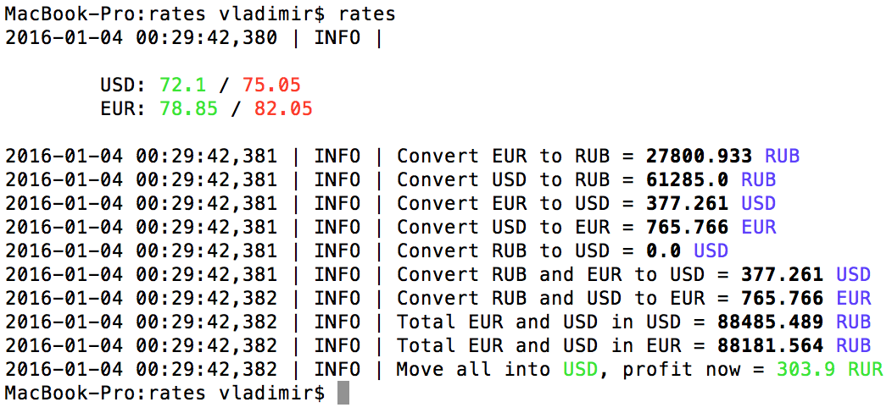

### Description

Logger - is a simple and flexible wrapper on Python's logging module with coloring output

### Demos

Logger is used in my [rates](https://github.com/d3QUone/rates) project:



### Install
 
`pip install git+https://github.com/d3QUone/logger`

### Update

`pip install --upgrade git+https://github.com/d3QUone/logger`

### How to use

(also check out [the provided example](examples/app.py)) 

1. Import module and create an instance:

```python
from logger import Logger

log = Logger("com.project_name")
```

In current example Logger will write logs in `log/com.project_name.log`

2. Log something:

```python
log.info("Server started - OK")

try:
    1/0
except Exception as e:
    log.error("Caught bug '%s' in '%s'", (e, __name__)
```

Interface `info(msg, extra=None)`, where `msg` can be a plain string or a string with parameters `%s`. `extra` is a tuple

Currently there are wrappers for `warn`, `info`, `debug`, `error`

3. Colorize the stdout:

```python
x = 0.01
log.warn("The request is pending for {} seconds from {}".format(
    Logger.colorize("red", x),
    Logger.colorize("blue", "/v1/create"),
))
```

Interface `colorize(color, data)`, available colors are ```python 'pink', 'blue', 'yellow', 'green', 'red', 'underline', 'bold'```

### Customization

You can change the default level or the default directory for storing logs: ... 

-----

Vladimir Kasatkin
