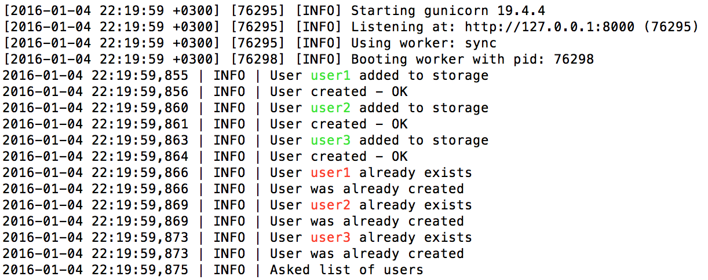
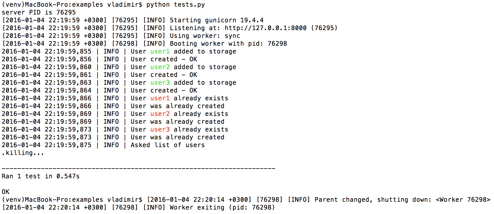

## Example

A simple authentication app built with `falcon` and `logger`

This app consists of two parts - a falcon request handler [**app.py**](app.py) and a high-level business logic [**managers.py**](managers.py). Both parts have their own loggers and logs: [**com.api.log**](log/com.api.log) and [**com.manager.log**](log/com.manager.log). 

## How to

### Setup

```bash
virtualenv venv
venv/bin/pip install -r requirements.txt
```

### Run

Run the server:

```bash
venv/bin/gunicorn app:api
```

In another terminal window:

```bash
curl -X POST -d "slug=zhooli&name=Eugen&email=volos@mail.ru&group=3" http://127.0.0.1:8000/user

curl -X POST -d "slug=good&name=VLadimir&email=vvv@yandex.ru&group=1" http://127.0.0.1:8000/user

curl -X POST -d "slug=good&name=VLadimir&email=vvv@yandex.ru&group=1" http://127.0.0.1:8000/user
```

Server output:



Or you can run the tests 

```bash
venv/bin/python tests.py
```

Tests output:



-----

Copyright 2016 Vladimir Kasatkin
